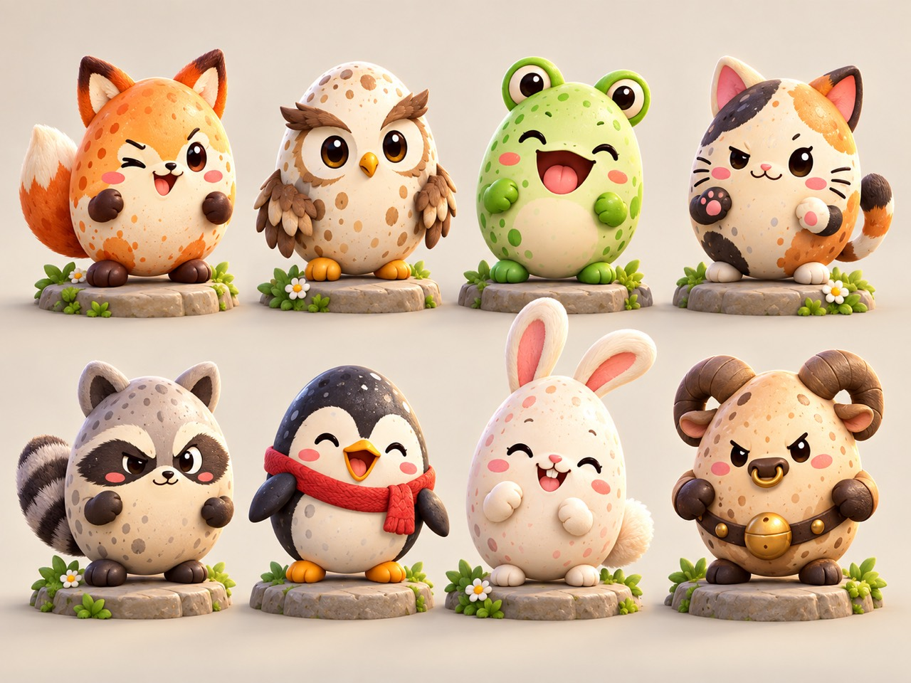
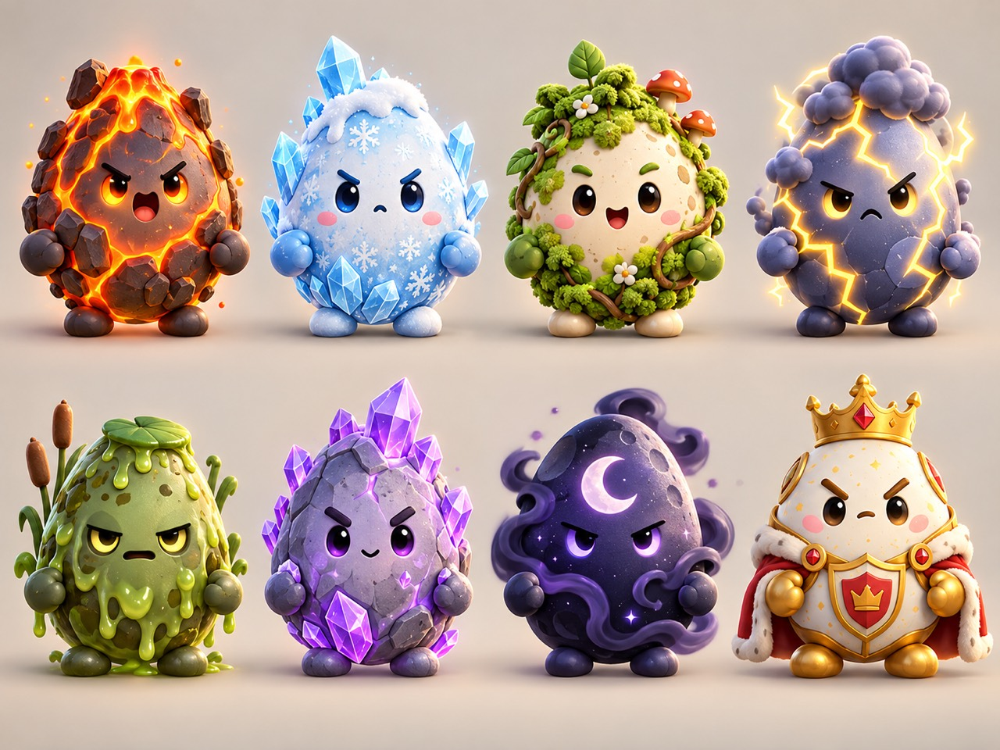
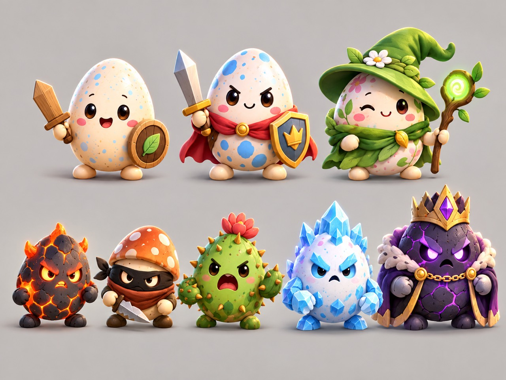
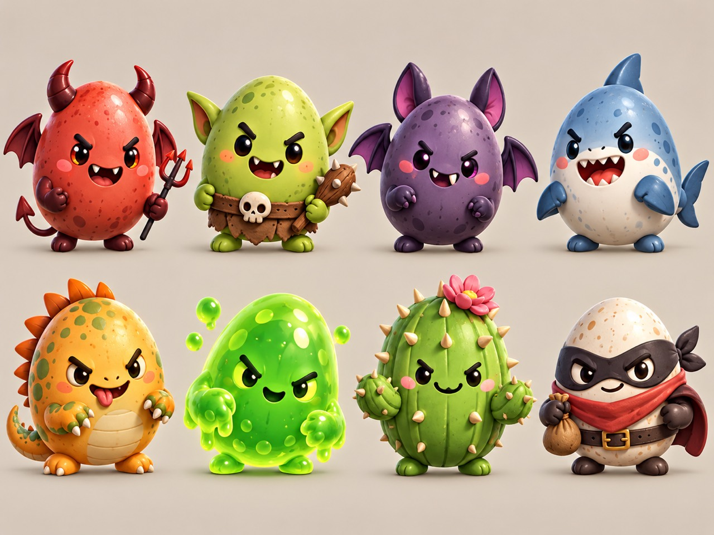

# Scramblewood toy art contract v1

Pip remains the simple customizable hero. The ten newcomers are authored collectible characters; anatomy and costumes stay in the faceless body. Expressions are independent transparent overlays. Character identities, personalities and dialogue are in `roster.json`.

## Reference board






Use these as visual direction, not as runtime collages. Warm cream shell, chunky sculpted forms, restrained shiny details, soft upper-left light, tiny hands and feet. The egg must remain recognizable behind costume and anatomy. Front view only, level eyes, no perspective turn, no pedestal, no baked scenery or ground shadow. Avoid thin unreadable accessories and obstructed faces.

## Source structure and generation

Each character has `master.png`, `body.png`, `faces/<state>.png`, `registration.json`, provenance, prepared assets and a review sheet. Masters establish identity. Faceless body edits replace only facial regions. Every expression is independently generated from an approved master or neutral face; never use the previous expression as the next reference. Prompt files describe generated states where available. Raw edit outputs are retained even when their background is unusable.

Use the built-in imagegen tool for generation. Do not silently switch to an API or model. It returns a local PNG: import that file using the offline command below. Generating a face does not redraw the body. Magenta is reserved for face extraction; inspect feature colours before promotion. The published output must have real alpha, never a painted checkerboard.

`registration.json` uses normalized original-canvas coordinates: `eraseRegions` contains left/top/right/bottom masks; `faceBox` is left/top/width/height for the canonical face canvas. The body edit is composited inside those masks, preserving the master's original alpha and all external pixels. Body and face then receive exactly the same canvas transform. Expressions are never independently cropped to their alpha bounding box.

## Offline commands

From the repository root:

```sh
python tooling/art-pipeline/scripts/scramblewood-avatars.py import tuck --slot neutral --source PATH_TO_GENERATED_PNG
python tooling/art-pipeline/scripts/scramblewood-avatars.py prepare tuck
python tooling/art-pipeline/scripts/scramblewood-avatars.py review tuck
python tooling/art-pipeline/scripts/scramblewood-avatars.py validate tuck
python tooling/art-pipeline/scripts/scramblewood-avatars.py approve tuck --reviewer REVIEWER_NAME
python tooling/art-pipeline/scripts/scramblewood-avatars.py promote tuck
```

Slots: master, body, neutral, half-blink, closed-blink, determined, attack, hurt, surprised, happy, defeated, talking. Import and prepare are resumable. A changed processed image invalidates approval. Promotion requires all ten expressions, valid 512px RGBA layers and a matching visual approval hash. It writes only this game's character assets and generated catalogs, leaving Katchimeras assets intact.

Review the body alone, then all expressions over it. Look for leftover faces, shifting eyes, opaque face patches, magenta fringes, clipped ears, mask/beak registration and foot contact. Review on pale and dark backgrounds at 48, 96, 160 and 256px. Do not approve a missing expression or substitute another character's face. Runtime thumbnails are 256px; layered runtime canvases are 512px. Masters remain at their generated native resolution.

## Story and unlocks

The Scramblewood Toll Patrol mistakes Golden Shell fragments for official badges. The first three home opponents are Tuck, Bramble and Morel. Beyond Dream Mist, Sir Hoot holds Pollen behind a permit dispute, Boggle guards a puddle, and Captain Crack wears an absurd acorn admiral's helmet. He admits: “I thought it said Golden Sheriff.” The next clearing introduces Pipistrelle, Cinder and Prism.

Pollen joins during FTUE. After Captain Crack, defeated rivals become freely claimable; each new third-clearing rival becomes claimable after its defeat. Claims do not change coins or combat power. Old encounter IDs and old Pollen ownership survive. Existing Pollen cosmetic records remain stored; the new authored body intentionally does not render incompatible gear.
