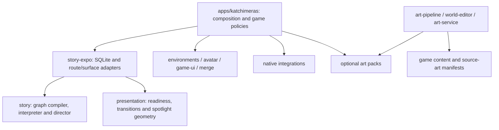

# Architecture and migration

The extraction makes shared systems depend on contracts and injected data. Katchimeras creates their instances and supplies its policies. A shared package must not import the app, its aliases, its save store or a sibling package by relative path. `npm run check:boundaries` checks imports, declared dependencies, public exports and dependency cycles.

## Ownership

| Package | Shared implementation | Katchimeras supplies |
| --- | --- | --- |
| `@incubator/story` | Graph types, compilation/validation, interpreter, catalog, effect registry, director, target registry | FTUE/story definitions, capabilities, domain effects, route and target IDs, upgrade validation |
| `@incubator/story-expo` | SQLite event/run persistence, surface hooks/host, route coordinator | Database name, SQLite opener, route return behavior, surface mapping and diagnostics |
| `@incubator/presentation` | Readiness curtain, mounted-asset readiness, spotlight geometry | Surface IDs, diagnostics switch, provider placement |
| `@incubator/environments` | Hex projection, tile artwork/reveal, retained-image crossfades, upgrade timing/effects, cinematic camera/gesture/LOD and progression context | Tile layout/profile, sources and LOD lookup, stage catalog, restoration costs/rewards, scene orchestration |
| `@incubator/avatar` | Stable layered image compositor, calibration math, expression playback | Egg catalog and art, selection/unlocks, calibration values, persistence |
| `@incubator/game-ui` | Theme factory, surfaces, buttons/panels/primitives, currency formatting | Font families, icon renderer, text component, app branding |
| `@incubator/merge` | Board geometry, order queries/windowing, serial work queue and save deadlines | Item taxonomy, generators, merge rules, campaign orders, inventory and economy |
| `@incubator/native-*` | Foundation Models, health routes, map search, semantic matching, speech and vision Expo modules | Permissions, entitlements, usage strings and game integration |
| `@incubator/art-service` | Five Deno HTTP handler factories for generation, background removal, idle animation and avatar rendering | Supabase function entrypoints, storage buckets, secrets and deployment |
| `@incubator/art-pipeline` | Python/JS generation, LOD/atlas processing, alpha checks, promotion and catalog emission | `incubator.json`, authored manifests, briefs and selected source art |
| `@incubator/world-editor` | Editor UI/server, validation, art registry and processing commands | World/scene data, source art, backups and temporary work |

Katchimeras keeps thin compatibility adapters at existing import locations. They instantiate shared factories once at module scope, so existing providers and consumers share a stable runtime. Registries, pending work and repository queues belong to instances; another game creates its own instances. Story definitions and save schema retain their existing identifiers. The graph repository still uses `katchimeras-content-flow.db`.

Scene playback has two layers: shared graph execution/navigation/readiness, and game-authored dialogue, interactions and effects. Hex tiles and cinematic environments share the same environment package and art pipeline, while retaining different renderer APIs. A cinematic-only game does not need a hex board, Haven upgrades or the merge engine.

All native package names changed at the npm level only. Swift module names, podspecs and widget/activity identifiers were preserved. The native map-search result types now belong to the native package. Art-service factories retain the existing provider and backend table contracts; another game must provision those contracts or extend the service adapter before deploying them.

## Art and authoring

Runtime imports use static package paths, such as `require('@incubator/art-merge-world/ui/bond.webp')`. Art is split into 28 optional packs. There is no runtime umbrella import that eagerly loads every pack. `art/catalog.json` lists the packages and locations.

`incubator.json` maps logical `assets`, `design` and native-source paths onto their physical locations. This preserves existing art manifests and generation provenance. Shared commands resolve these roots explicitly; app script wrappers select the game using `INCUBATOR_GAME_ROOT`. Python generators emit package-aware static imports. The shared tool package includes the existing Katchimeras authoring recipes; a new game can supply its own manifests and use only the recipes it needs.

`art-source/katchimeras` contains source/reference art and review material. Some production masters intentionally remain alongside runtime tiers inside art packs to support existing regeneration contracts. EAS uses Metro's actual asset map plus native-target references to exclude unused masters and art. npm release packs include their declared art files; they do not use the app's EAS exclusions.

## Staging and next extractions

1. **Workspace and build cutover:** completed. Root lockfile; app under `apps`; moved native modules; root EAS archive policy; GitHub Actions app working directory.
2. **Reusable runtime boundaries:** completed for the implementations listed above. Game adapters preserve current behavior and saves.
3. **Shared authoring and optional art:** completed. Generation/editor implementations live in tooling packages; app content chooses inputs and output locations.
4. **Independent consumption:** package manifests, pinned internal dependencies, selective packing and a temporary packed-package consumer are implemented. Registry publication remains a release operation.
5. **Further domain extraction:** deliberately incremental. The large merge engine, FTUE experience panels, kingdom scene orchestration and game-specific UI still live in Katchimeras. Extract another mechanism when a second game's requirements establish its contract; do not move game policy into shared packages merely because it is large.

The packages currently export TypeScript/TSX source for Expo/Metro and TypeScript-aware consumers. They are not a compiled CommonJS SDK. Story/surface IDs use augmentable type registries; typecheck each game separately so its registry declarations do not collide with another game's declarations.
